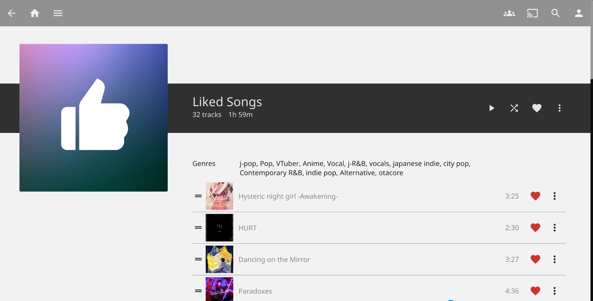
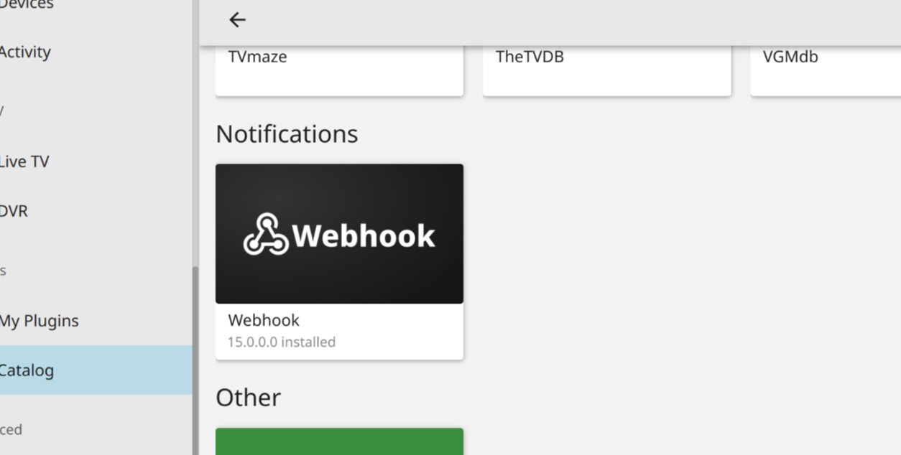
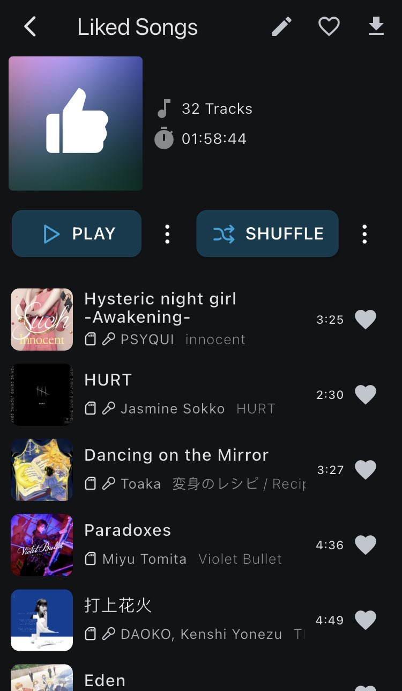

<div align="center">

<h1> Jellyfin Liked Songs Playlist </h1>
</div>

A virtual playlist that is linked to "Favourite" tracks on jellyfin.



## Setting Up

> This tool has been tested to be working on Jellyfin Server 10.10.3
> Older/Future versions may require more testing.

### Python

This tool makes use of Python's fastAPI framework for handling POST requests sent by the Jellyfin server.

Installing dependencies
```sh
pip install fastapi uvicorn requests
```

Once they have installed, you can change `config.json` as per your setup. You can change the host, port that the server will try to send the webhooks to as well as the Liked Songs playlist icon.

Next you would need to change accounts in `accounts.json`. This tool supports multiple accounts as well as multiple accounts of different servers, you just need to change the credentials to the correct ones.

Run the script normally like a python file **from the project root**:

```sh
python jf-liked-playlist/main.py
```

Every time you run the script, it would sync up the playlist songs with the ones that have been marked as favorite.

### Webhooks

First install the webhooks plugin from the official plugin catalog.



Once the plugin has been successfully installed and you have restarted the server, from the server dashboard go to `My Plugins > Webhook`

Set the `Server Url` as the url that you configured in `config.json`:

```
http://{HOST}:{PORT}
```

In my case, it looked something like `http://192.168.1.16:7079`

Then **Add Generic Destination** and set the following fields:

- Webhook Name: Anything you want

- Webhook URL: `http://{PORT}:{HOST}/post`

- Status: Enable (checked)

- Notification Type: User Data Saved (checked)

- User Filter: Check the users that you have specified in `accounts.json`

- Item Type: Songs (checked)

- Do not send when message body is empty (checked)

Copy and paste the following code for the template:

```json
{{~#if_equals SaveReason 'UpdateUserRating'~}}
{
    "item_id": "{{ItemId}}",
    "name": "{{Name}}",
    "saveReason": "{{SaveReason}}",
    "user_id": "{{UserId}}"
}
{{~else~}}{{~/if_equals~}}
```

Then click on **Add Request Header** and fill it out with the following entries:

- Key: Content-Type

- Value: Application/json

Once this has been filled in, click on save.

And that's it, there should be a "Liked Songs" playlist in your library now!!!

> **WARNING**
> <br>Do not manually add items to the "Liked Songs" playlist.<br>
> Always use the heart button to add or remove songs!

### Some Footnotes

I believe this would be a much more clean and simple thing if it were a Jellyfin plugin, however I do not know how to code in C# so this was the quickest and easiest way I could come up with that worked well with my setup!

I made this plugin specifically so that I could use it with Finamp which currently doesn't provide a better way to play and manage all of your favorite tracks.

